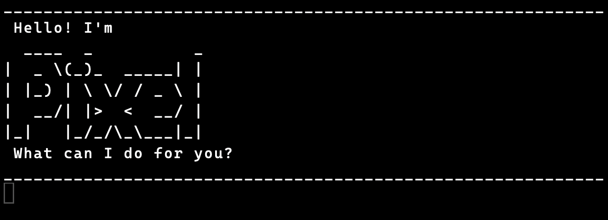

# Pixel User Guide


Pixel is a CLI task assistant. It supports various task types and task display commands.

## Quick start
1. Build and run:
   ```bash
   $ javac -d bin src/main/java/*.java
   $ java -classpath bin Pixel
   ```
2. Type commands followed by Enter.

## Commands
- `todo DESCRIPTION` — add a todo.
- `deadline DESCRIPTION /by TIME` — add a deadline.
- `event DESCRIPTION /from START /to END` — add an event.
- `list` — show all tasks.
- `mark INDEX` — mark a task done (1-based).
- `unmark INDEX` — mark a task not done.
- `delete INDEX` — remove a task.
- `bye` — exit.

## Add various task types
Support for todos, deadlines and events:
```
$ todo borrow book
____________________________________________________________
 Got it. I've added this task:
   [T][ ] borrow book
 Now you have 1 tasks in the list.
____________________________________________________________
$ deadline return book /by Sunday
____________________________________________________________
 Got it. I've added this task:
   [D][ ] return book (by: Sunday)
 Now you have 2 tasks in the list.
____________________________________________________________
$ event project meeting /from Mon 2pm /to 4pm
____________________________________________________________
 Got it. I've added this task:
   [E][ ] project meeting (from: Mon 2pm to: 4pm)
 Now you have 3 tasks in the list.
____________________________________________________________
```
## Mark and unmark tasks
```
$ mark 2
____________________________________________________________
 Nice! I've marked this task as done:
   [D][X] return book (by: Sunday)
____________________________________________________________
$ unmark 2
____________________________________________________________
 OK, I've marked this task as not done yet:
   [D][ ] return book (by: Sunday)
____________________________________________________________
```
## Remove tasks
```
$ delete 3
____________________________________________________________
 Noted. I've removed this task:
   [E][ ] project meeting (from: Mon 2pm to: 4pm)
 Now you have 2 tasks in the list.
____________________________________________________________
```

### Data Persistence

All your tasks are automatically saved to `./data/pixel.txt` whenever you:

- Add a new task
- Mark/unmark a task
- Delete a task

When you restart Pixel, your tasks are automatically loaded. The data file uses
this format:

```
T | 1 | read book
D | 0 | return book | June 6th
E | 0 | project meeting | Aug 6th 2pm | 4pm
```

- First field: Task type (T/D/E)
- Second field: Status (1=done, 0=not done)
- Remaining fields: Task details

## Error Handling

Pixel handles various error cases gracefully:

- Empty descriptions: `OOPS!!! The description cannot be empty.`
- Missing parameters: `OOPS!!! A deadline must include /by.`
- Invalid task numbers: `OOPS!!! The task index is invalid.`
- Unknown commands: `OOPS!!! I'm sorry, but I don't know what that means :-(`
