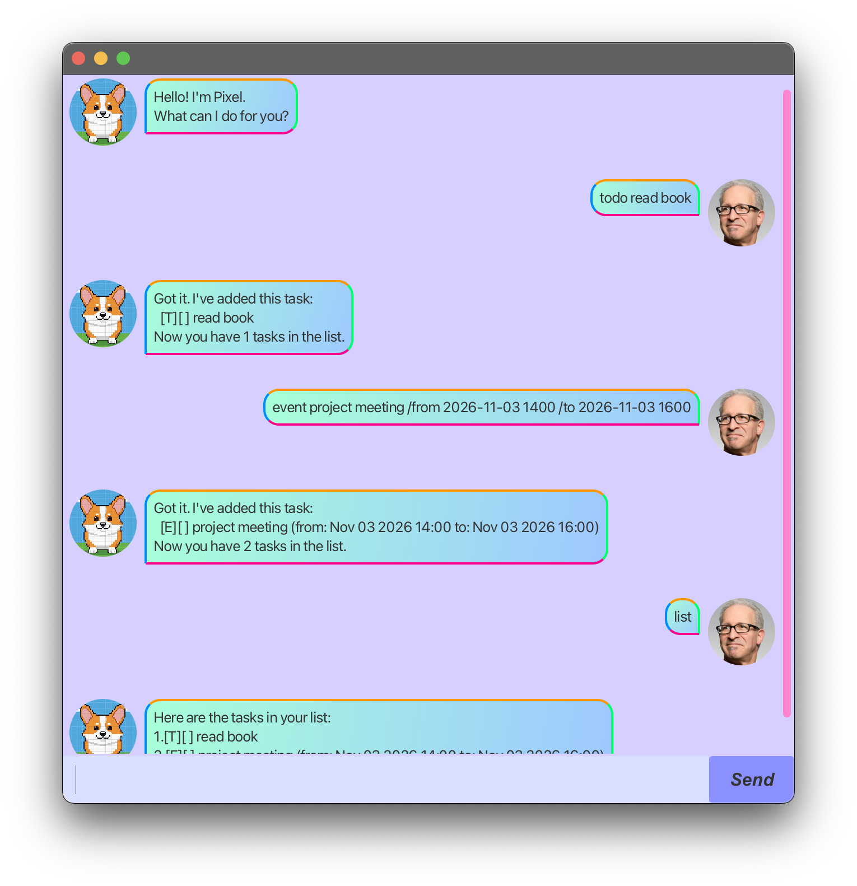

# Pixel User Guide



Pixel is a friendly GUI task assistant that helps you keep track of your todos,
deadlines, and events. All tasks are automatically saved to disk and loaded when
you restart the application.

## Features

- Modern JavaFX interface
- Add three types of tasks: todos, deadlines, and events
- Mark tasks as done or not done
- Delete tasks from your list
- Search for tasks
- Detection of duplicate tasks
- Tasks are saved automatically
- Display task list with status markers

## Quick start

1. Ensure you have Java 11 or above installed with JavaFX support.
2. Download and run the jar file from the latest release.
4. Type your commands in the text bar and press Enter or click Send.

## Commands Summary

| Command       | Format                                                            |
| ------------- | ----------------------------------------------------------------- |
| Add todo      | `todo DESCRIPTION`                                                |
| Add deadline  | `deadline DESCRIPTION /by yyyy-MM-dd [HHmm]`                      |
| Add event     | `event DESCRIPTION /from yyyy-MM-dd [HHmm] /to yyyy-MM-dd [HHmm]` |
| List tasks    | `list`                                                            |
| Mark done     | `mark INDEX`                                                      |
| Mark not done | `unmark INDEX`                                                    |
| Delete task   | `delete INDEX`                                                    |
| Find tasks    | `find KEYWORD [MORE_KEYWORDS...]`                                 |
| Exit          | `bye`                                                             |

## Feature Details

### Add various task types

Pixel supports three types of tasks

- **Todo [T]**: Simple tasks
- **Deadline [D]**: Tasks with a deadline
- **Event [E]**: Tasks with a start and end date/time

### Display all tasks

View all your tasks with their statuses.

### Mark and unmark tasks

Track completion status with `[X]` for done and `[ ]` for not done.

### Delete tasks

Remove tasks you no longer need.

### Find tasks

Search for tasks using flexible keyword matching

- **Case-insensitive**: `book` matches `Book` or `BOOK`
- **Partial matching**: `meet` matches `meeting`
- **Multiple keywords**

### Duplicate detection

When you try to add a task that already exists, Pixel will detect it and ask for
confirmation.

**Duplicate detection rules**

- Same task type (Todo, Deadline, or Event)
- Same description
- For Deadlines: Same date/time
- For Events: Same start and end date/time

### Data Persistence

All your tasks are automatically saved to `./data/pixel.txt` whenever you:

- Add a new task
- Mark/unmark a task
- Delete a task

When you restart Pixel, your tasks are automatically loaded. The data file uses
this format:

```
T | 1 | read book
D | 0 | return book | 2026-06-06 1800
E | 0 | project meeting | 2026-08-06 1400 | 2026-08-06 1600
```

- First field: Task type (T/D/E)
- Second field: Status (1=done, 0=not done)
- Remaining fields: Task details (dates stored as yyyy-MM-dd HHmm)

## Error Handling

Pixel handles various error cases gracefully:

- Empty descriptions: `OOPS!!! The description cannot be empty.`
- Missing parameters: `OOPS!!! A deadline must include /by.`
- Invalid task numbers: `OOPS!!! The task index is invalid.`
- Unknown commands: `OOPS!!! I'm sorry, but I don't know what that means :-(`
